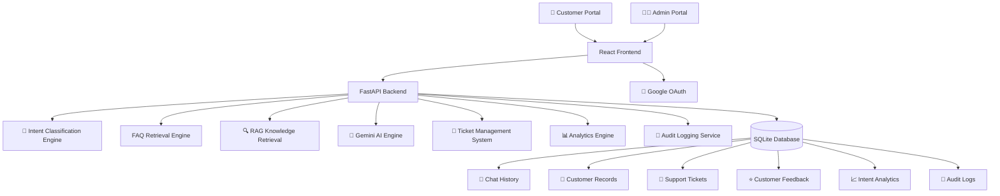
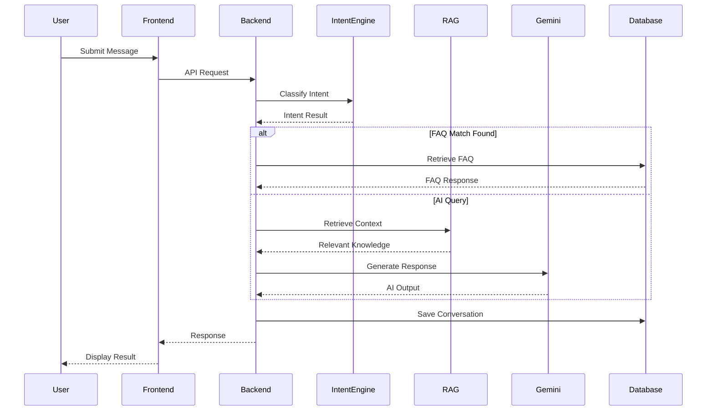
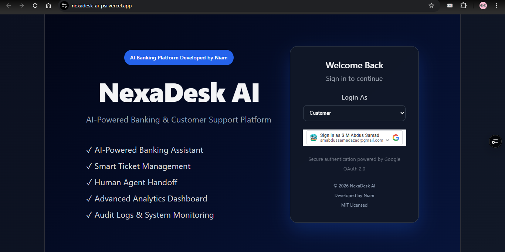
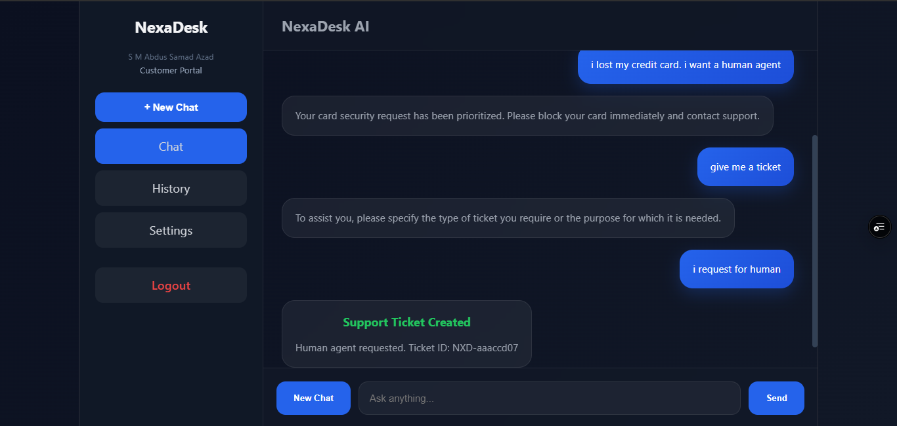
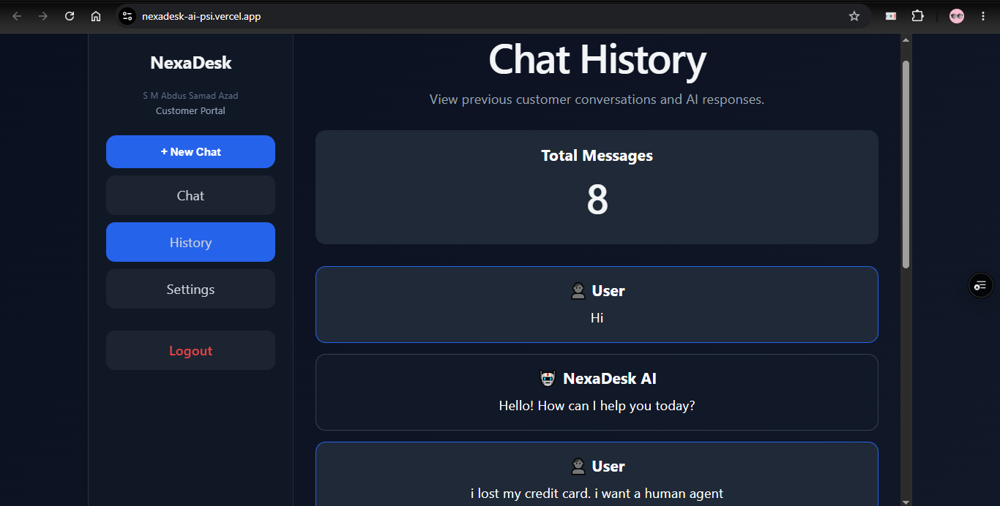
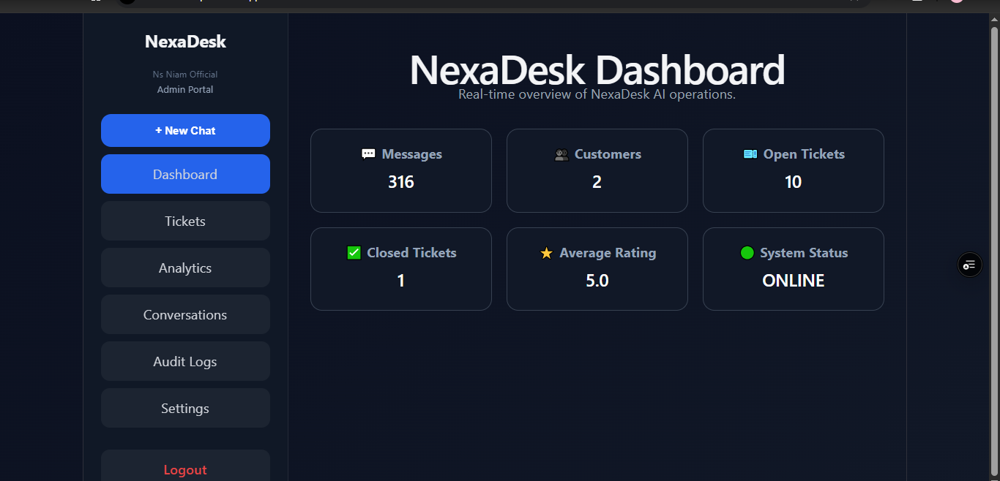
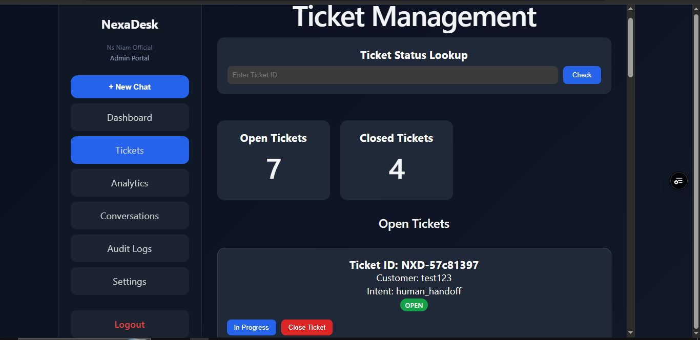
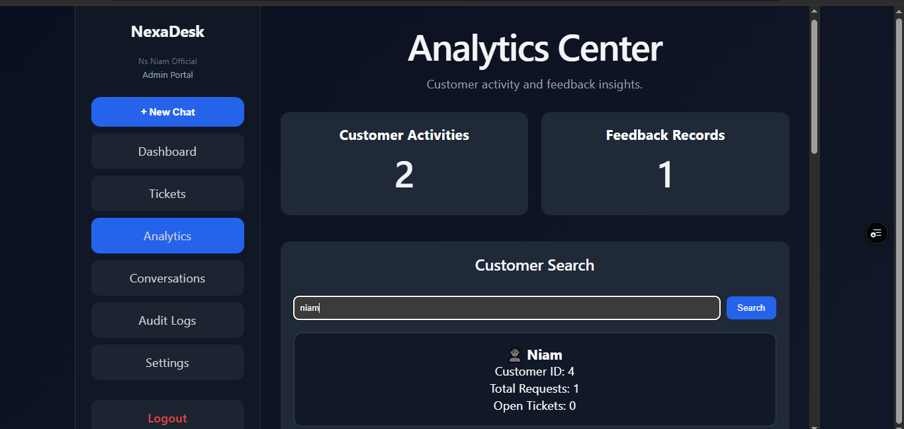
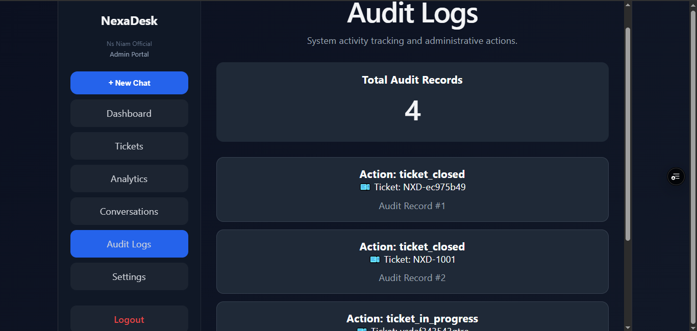
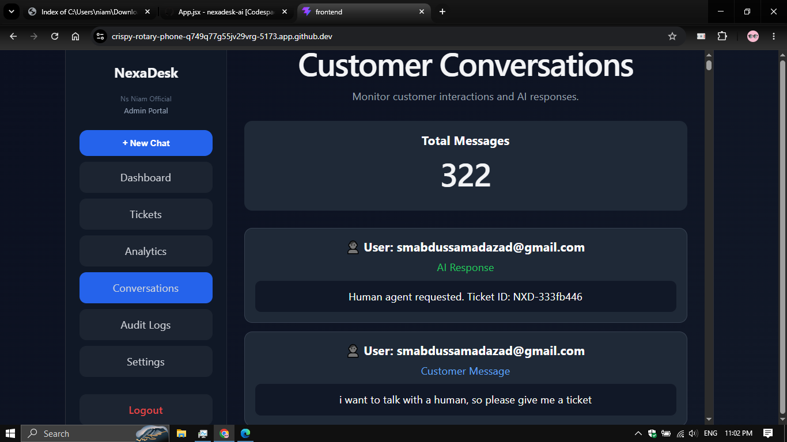

<div align="center">

#  NexaDesk AI

### Intelligent Banking Customer Support & Ticket Management Platform

<p>
  AI-Powered Banking Assistant • Human Agent Handoff • Smart Ticketing • Analytics • RAG Knowledge Retrieval
</p>

<br>


<br><br>

###  Live Demo

https://github.com/user-attachments/assets/73fd1727-adad-4602-8bfc-d92c9366eaaa

<br>

###  Live Applications

| Service     | Link                                             |
| ----------- | --------------------------------------           |
| Frontend    | https://nexadesk-ai-psi.vercel.app               |
| Backend API |https://nexadesk-ai-production.up.railway.app/docs|
| Repository  | https://github.com/ns-niam/nexadesk-ai           |

</div>

---

##  Overview

NexaDesk AI is a full-stack AI-powered banking customer support platform designed to simulate enterprise-grade banking operations.

The platform combines conversational AI, ticket lifecycle management, customer analytics, audit monitoring, RAG-powered information retrieval, and secure authentication into a unified support ecosystem.

Customers can interact with an intelligent banking assistant, create support requests, track conversations, and receive automated assistance, while administrators gain access to operational analytics, customer activity monitoring, ticket management workflows, and audit logs.

---

##  Core Capabilities

*  AI-Powered Banking Assistant
*  Smart Ticket Management System
*  Human Agent Escalation Workflow
*  RAG-Based Knowledge Retrieval
*  Customer Analytics Dashboard
*  Audit Logging & Monitoring
*  Google OAuth Authentication
*  Multi-User Session Isolation
*  Customer Intent Analytics
*  Customer Conversation Monitoring
*  Feedback & Rating System
*  Production Deployment (Vercel + Railway)

---


## System  Architecture



---

##  Request Processing Workflow



---

##  Core System Components

###  AI Banking Assistant

The conversational intelligence layer responsible for:

* Banking inquiry handling
* Loan information support
* Credit card assistance
* Balance inquiries
* Customer guidance
* Knowledge retrieval
* AI-generated responses

Powered by:

* Google Gemini AI
* Retrieval-Augmented Generation (RAG)
* Intent Classification Pipeline

---

###  Ticket Management Engine

Automatically creates and manages support requests when escalation is required.

Supported workflows:

* Human Agent Handoff
* Customer Complaints
* Service Requests
* Phone Number Updates
* Email Updates
* Address Changes
* KYC Requests

Ticket Lifecycle:

```text
OPEN
  ↓
IN PROGRESS
  ↓
CLOSED
```

---

###  Retrieval-Augmented Generation (RAG)

NexaDesk AI enhances response quality through a knowledge retrieval pipeline.

Responsibilities:

* Banking policy retrieval
* Context enrichment
* Knowledge grounding
* Accurate AI responses

Benefits:

* Reduced hallucinations
* Improved banking knowledge accuracy
* Faster information access

---

###  Analytics & Intelligence Layer

Provides operational visibility into customer interactions.

Tracked Metrics:

* Customer Activities
* Ticket Statistics
* Feedback Ratings
* Intent Distribution
* Customer Engagement
* Service Utilization

Admin dashboards use these metrics to evaluate system performance and customer satisfaction.

---

###  Audit Logging System

Every important administrative action is recorded.

Examples:

* Ticket Status Changes
* Ticket Closures
* Customer Operations
* Administrative Activities

Benefits:

* Accountability
* Traceability
* Monitoring
* Compliance Support

---

###  Authentication & Access Control

Authentication is handled through Google OAuth 2.0.

Role-Based Access:

#### Customer Portal

Access to:

* AI Chat
* Personal History
* Settings

#### Admin Portal

Access to:

* Dashboard
* Ticket Management
* Analytics
* Customer Conversations
* Audit Logs
* System Monitoring

Admin privileges are restricted to authorized email accounts.

---

##  Data Layer

NexaDesk AI uses SQLite for persistent data storage.

Stored Entities:

| Entity             | Purpose                    |
| ------------------ | -------------------------- |
| Chat History       | Conversation Persistence   |
| Customers          | User Records               |
| Tickets            | Support Requests           |
| Feedback           | Customer Ratings           |
| Intent Logs        | AI Analytics               |
| Audit Logs         | Administrative Tracking    |
| FAQ Knowledge Base | Instant Response Retrieval |

---

##  Technology Stack

### Frontend

* React
* Vite
* JavaScript
* Google OAuth

### Backend

* FastAPI
* Python
* REST APIs
* Dependency Injection

### Artificial Intelligence

* Google Gemini
* RAG Pipeline
* Intent Classification
* FAQ Retrieval

### Database

* SQLite

### Deployment

* Railway (Backend)
* Vercel (Frontend)
* GitHub (Version Control)

---

##  Scalability Vision

Future versions of NexaDesk AI are planned to include:

* PostgreSQL Migration
* Multi-Tenant Architecture
* Real-Time Notifications
* Role-Based Permission Management
* AI Agent Orchestration
* Vector Database Integration
* Advanced Reporting
* Enterprise Banking Integrations
* Multi-Language Support
* SaaS Subscription Platform

```
```

#  Platform Showcase

Explore the key interfaces and capabilities of NexaDesk AI through the following screenshots.

---

##  Authentication & Access Control

### Login Experience

Secure Google OAuth authentication with role-based access control for both customers and administrators.

<p align="center">
  
</p>

---

##  AI Banking Assistant

Customers can interact with an intelligent banking assistant capable of handling banking inquiries, service requests, account-related questions, and support operations.

<p align="center">
  
</p>

### Features Demonstrated

* AI Banking Support
* Intent Classification
* Knowledge Retrieval
* Ticket Generation
* Human Agent Escalation

---

##  Customer Conversation History

Each customer maintains isolated conversation history using session-based user identification.

<p align="center">
  
</p>

### Capabilities

* User-Specific History
* Session Isolation
* Persistent Conversations
* Secure Data Separation

---

##  Administrative Dashboard

The admin dashboard provides a centralized overview of system activity, customer engagement, and operational metrics.

<p align="center">
  
</p>

### Dashboard Metrics

* Customer Statistics
* Open Tickets
* Closed Tickets
* Service Activity
* Operational Insights

---

##  Ticket Management Center

Administrators can manage support requests throughout the complete ticket lifecycle.

<p align="center">
  
</p>

### Ticket Operations

* Ticket Search
* Open Ticket Tracking
* In-Progress Management
* Ticket Closure
* Status Monitoring

---

##  Analytics & Intelligence

Advanced analytics provide visibility into customer interactions, satisfaction metrics, and service performance.

<p align="center">
  
</p>

### Analytics Features

* Customer Activity Monitoring
* Feedback Statistics
* Customer Satisfaction Tracking
* Service Performance Metrics

---

##  Customer Intent Intelligence

The system automatically classifies customer requests and generates intent analytics.

<p align="center">
  
</p>

### Tracked Intent Categories

* Loan Inquiry
* Account Opening
* Credit Card Support
* Human Handoff
* Service Requests
* Customer Complaints

---

##  Feedback Management

Customer satisfaction is collected and analyzed through the integrated feedback system.

<p align="center">
  
</p>

### Feedback Metrics

* Ratings
* Customer Reviews
* Satisfaction Monitoring
* Quality Assessment

---

##  Audit Logging System

All administrative actions are recorded for transparency and operational monitoring.

<p align="center">
  
</p>

### Logged Activities

* Ticket Updates
* Status Changes
* Administrative Actions
* System Events

---

##  Customer Conversation Monitoring

Administrators can monitor customer interactions and AI-generated responses through the conversation monitoring dashboard.

<p align="center">
  
</p>

### Monitoring Features

* Customer Interaction Tracking
* AI Response Review
* Support Quality Monitoring
* Operational Oversight

---

##  Ticket Status Lookup

Support teams can quickly search and verify ticket status across the platform.

<p align="center">
  
</p>

### Benefits

* Faster Resolution Tracking
* Ticket Visibility
* Operational Efficiency
* Customer Support Management


#  Technology Stack & Development Tools

NexaDesk AI is built using a modern full-stack architecture that combines frontend technologies, backend services, artificial intelligence, authentication systems, analytics, and cloud deployment platforms.

The technology stack was selected to provide scalability, maintainability, rapid development, and production-ready deployment capabilities.

---

#  Frontend Technologies

The frontend is responsible for delivering a modern, responsive, and interactive user experience for both customers and administrators.

| Technology        | Purpose                                    |
| ----------------- | ------------------------------------------ |
| React             | Component-Based User Interface Development |
| Vite              | High-Performance Frontend Build Tool       |
| JavaScript (ES6+) | Application Logic                          |
| CSS3              | Responsive User Interface Styling          |
| Google OAuth      | Secure User Authentication                 |
| Fetch API         | Backend Communication                      |

### Frontend Responsibilities

* Customer Portal
* Admin Portal
* Authentication Flow
* Dashboard Visualization
* Ticket Management Interface
* Analytics Interface
* Chat Experience
* Conversation History

---

#  Backend Technologies

The backend serves as the core orchestration layer of NexaDesk AI.

It handles business logic, API processing, ticket workflows, analytics generation, authentication validation, and AI integrations.

| Technology           | Purpose                        |
| -------------------- | ------------------------------ |
| FastAPI              | High-Performance API Framework |
| Python               | Backend Development            |
| REST APIs            | Client-Server Communication    |
| Dependency Injection | Authentication & API Security  |
| Uvicorn              | ASGI Application Server        |

### Backend Responsibilities

* Request Processing
* Intent Classification
* Ticket Management
* User Registration
* Analytics Generation
* Audit Logging
* AI Orchestration
* Session Management

---

#  Artificial Intelligence Stack

The intelligence layer powers the AI banking assistant and customer support automation.

| Technology                   | Purpose                       |
| ---------------------------- | ----------------------------- |
| Google Gemini                | AI Response Generation        |
| Prompt Engineering           | Context-Aware AI Responses    |
| Intent Classification Engine | Customer Request Detection    |
| FAQ Retrieval System         | Instant Response Retrieval    |
| RAG Pipeline                 | Knowledge-Augmented Responses |

### AI Capabilities

* Banking Assistance
* Customer Support Automation
* Intent Detection
* Knowledge Retrieval
* Context-Aware Responses
* Human Handoff Decision Support

---

#  Retrieval-Augmented Generation (RAG)

NexaDesk AI uses a Retrieval-Augmented Generation architecture to improve answer quality.

| Component         | Function                    |
| ----------------- | --------------------------- |
| Knowledge Base    | Banking Information Storage |
| Retrieval Layer   | Relevant Context Discovery  |
| Context Injection | Prompt Enhancement          |
| Gemini AI         | Response Generation         |

### Benefits

* Reduced Hallucinations
* Improved Accuracy
* Knowledge Grounding
* Better Customer Experience

---

#  Database Layer

The data persistence layer stores all critical business information.

| Technology | Purpose                 |
| ---------- | ----------------------- |
| SQLite     | Persistent Data Storage |

### Stored Entities

| Entity             | Description                |
| ------------------ | -------------------------- |
| Chat History       | Customer Conversations     |
| Customers          | User Records               |
| Support Tickets    | Ticket Lifecycle Data      |
| Feedback           | Customer Satisfaction Data |
| Intent Logs        | Analytics Information      |
| Audit Logs         | Administrative Activities  |
| FAQ Knowledge Base | Instant Support Responses  |

---

#  Authentication & Security

Security is implemented through modern authentication practices.

| Technology                | Purpose                      |
| ------------------------- | ---------------------------- |
| Google OAuth 2.0          | User Authentication          |
| API Key Validation        | Protected API Access         |
| Session Isolation         | Multi-User Separation        |
| Role-Based Access Control | Admin & Customer Permissions |

### Security Features

* Secure Login
* Protected Endpoints
* Session Isolation
* User-Level Data Separation
* Administrative Access Restriction

---

#  Analytics & Monitoring

Operational intelligence and system monitoring capabilities.

| Feature                    | Purpose                   |
| -------------------------- | ------------------------- |
| Intent Analytics           | Customer Request Analysis |
| Customer Activity Tracking | Usage Monitoring          |
| Ticket Analytics           | Support Performance       |
| Feedback Analysis          | Customer Satisfaction     |
| Audit Logs                 | Operational Visibility    |

### Business Benefits

* Performance Tracking
* Customer Insights
* Operational Monitoring
* Service Optimization

---

#  Cloud Deployment Stack

NexaDesk AI is deployed using a modern cloud architecture.

| Platform | Purpose                         |
| -------- | ------------------------------- |
| Vercel   | Frontend Hosting                |
| Railway  | Backend Hosting                 |
| GitHub   | Version Control & Collaboration |

### Deployment Workflow

```text
Developer
     ↓
GitHub Repository
     ↓
Automatic Deployment
     ↓

Frontend → Vercel

Backend → Railway
```

### Advantages

* Continuous Deployment
* Cloud Accessibility
* Rapid Updates
* Production Availability

---

#  Development Environment

Tools used throughout development.

| Tool                      | Purpose                 |
| ------------------------- | ----------------------- |
| Visual Studio Code        | Development Environment |
| Git                       | Source Control          |
| GitHub                    | Repository Management   |
| GitHub Codespaces         | Cloud Development       |
| Postman / Browser Testing | API Validation          |

---

#  Project Statistics

| Category             | Count |
| -------------------- | ----- |
| Frontend Frameworks  | 2+    |
| Backend Technologies | 4+    |
| AI Components        | 5+    |
| Database Modules     | 7+    |
| Analytics Features   | 5+    |
| Security Layers      | 4+    |
| Cloud Platforms      | 3     |
| User Roles           | 2     |
| Major Modules        | 12+   |

---

##  Engineering Philosophy

NexaDesk AI was designed with a focus on:

* Scalability
* Maintainability
* Security
* User Experience
* AI Integration
* Enterprise Architecture Principles

The project demonstrates how modern AI systems can be integrated into customer support environments while maintaining operational visibility, security, and extensibility.


#  Project Structure

NexaDesk AI follows a modular full-stack architecture designed to separate user interfaces, business logic, artificial intelligence services, analytics, authentication, and data persistence.

This structure improves maintainability, scalability, and future extensibility.

---

## 📂 Repository Structure

```text

NexaDesk-AI
│
│
├── frontend
│   │
│   ├── public
│   │   ├── favicon.svg
│   │   └── icons.svg
│   │
│   ├── src
│   │   │
│   │   ├── assets
│   │   │
│   │   ├── components
│   │   │   ├── Sidebar.jsx
│   │   │   └── StatsCard.jsx
│   │   │
│   │   ├── pages
│   │   │   ├── LoginPage.jsx
│   │   │   ├── ChatPage.jsx
│   │   │   ├── HistoryPage.jsx
│   │   │   ├── DashboardPage.jsx
│   │   │   ├── TicketsPage.jsx
│   │   │   ├── AnalyticsPage.jsx
│   │   │   ├── AuditLogsPage.jsx
│   │   │   ├── ConversationsPage.jsx
│   │   │   └── SettingsPage.jsx
│   │   │
│   │   ├── services
│   │   │   └── api.js
│   │   │
│   │   ├── App.jsx
│   │   ├── App.css
│   │   ├── index.css
│   │   └── main.jsx
│   │
│   ├── package.json
│   ├── package-lock.json
│   ├── vite.config.js
│   └── node_modules
│
├── backend
│   │
│   ├── app
│   │   │
│   │   ├── models
│   │   │   ├── __init__.py
│   │   │   └── chat.py
│   │   │
│   │   ├── rag
│   │   │   ├── document_loader.py
│   │   │   ├── retriever.py
│   │   │   └── vector_store.py
│   │   │
│   │   ├── routes
│   │   │   └── __init__.py
│   │   │
│   │   └── services
│   │       ├── __init__.py
│   │       ├── auth.py
│   │       ├── chat_context.py
│   │       ├── config.py
│   │       ├── customer_profile.py
│   │       ├── database.py
│   │       ├── extract_customer_data.py
│   │       ├── gemini_service.py
│   │       ├── groq_service.py
│   │       ├── intent_classifier.py
│   │       ├── knowledge_base.py
│   │       ├── memory.py
│   │       ├── memory_manager.py
│   │       ├── rag_service.py
│   │       ├── security.py
│   │       ├── session_manager.py
│   │       └── ticket_manager.py
│   │
│   ├── docs
│   │   ├── credit_cards.txt
│   │   └── loans.txt
│   │
│   ├── .env
│   ├── requirements.txt
│   ├── test_rag.py
│   └── venv
│
├── datasets
├── docs
│
├── screenshots
│   ├── login-page.png
│   ├── customer-chat.png
│   ├── customer-history.png
│   ├── admin-dashboard.png
│   ├── ticket-management.png
│   ├── analytics-page.png
│   ├── conversations.png
│   ├── audit-logs.png
│   ├── customer-feedbacks.png
│   ├── top-customer-intents.png
│   └── ticket-status-lookup.png
│
├── video
│   └── nexadesk-demo.mp4
│
├── README.md
├── LICENSE
└── .gitignore
```

---

#  Frontend Architecture

The frontend is responsible for user interaction, authentication, dashboard rendering, customer support workflows, and administrative operations.

### Major Modules

| Module            | Responsibility                |
| ----------------- | ----------------------------- |
| LoginPage         | Google OAuth Authentication   |
| ChatPage          | AI Customer Support Interface |
| HistoryPage       | Customer Conversation History |
| DashboardPage     | Administrative Metrics        |
| TicketsPage       | Ticket Lifecycle Management   |
| AnalyticsPage     | Customer Analytics            |
| ConversationsPage | Conversation Monitoring       |
| AuditLogsPage     | Administrative Audit Trail    |
| Sidebar           | Navigation & Role Routing     |

---

#  Backend Architecture

The FastAPI backend acts as the central orchestration layer.

It processes customer requests, invokes AI services, manages ticket workflows, handles analytics, and persists application data.

### Core Responsibilities

* Request Processing
* Intent Classification
* Authentication Validation
* AI Response Generation
* Ticket Lifecycle Management
* Customer Analytics
* Audit Logging
* Database Operations

---

#  AI Services Layer

The AI layer is separated into specialized services.

```text
Customer Message
       │
       ▼

Intent Classification
       │
       ▼

FAQ Retrieval
       │
       ▼

RAG Context Retrieval
       │
       ▼

Gemini AI
       │
       ▼

Response Generation
```

### AI Service Components

| Service              | Purpose                   |
| -------------------- | ------------------------- |
| intent_classifier.py | Customer Intent Detection |
| faq_service.py       | FAQ Matching & Retrieval  |
| rag_service.py       | Context Retrieval         |
| gemini_service.py    | AI Response Generation    |

---

#  Database Architecture

SQLite is used as the persistent storage layer.

### Core Tables

| Table        | Purpose               |
| ------------ | --------------------- |
| chat_history | Conversation Storage  |
| customers    | Customer Records      |
| tickets      | Support Requests      |
| feedback     | Customer Ratings      |
| intent_logs  | Intent Analytics      |
| audit_logs   | Administrative Events |
| faq          | Knowledge Base        |

---

#  Ticket Management Flow

```text
Customer Request
        │
        ▼

Intent Detection
        │
        ▼

Ticket Creation
        │
        ▼

OPEN
        │
        ▼

IN PROGRESS
        │
        ▼

CLOSED
```

---

#  Authentication Flow

```text
User
   │
   ▼

Google OAuth Login
   │
   ▼

Google Identity Verification
   │
   ▼

Role Assignment
   │
   ├── Customer
   │
   └── Admin
```

### Access Control

#### Customer Access

* AI Chat
* Personal History
* Settings

#### Administrator Access

* Dashboard
* Analytics
* Ticket Management
* Customer Conversations
* Audit Logs
* Monitoring Tools

---

#  API Architecture

The platform follows a REST-based architecture.

### Major Endpoint Categories

```text
Authentication APIs

Chat APIs

History APIs

Ticket APIs

Analytics APIs

Customer APIs

Feedback APIs

Audit APIs

Admin APIs
```

---

#  Deployment Structure

```text
GitHub Repository
        │
        ▼

Continuous Deployment
        │
        ├─────────────┐
        │             │
        ▼             ▼

Vercel        Railway

Frontend      Backend
        │
        ▼

Google OAuth
        │
        ▼

Gemini AI
        │
        ▼

SQLite Database
```

---

#  Scalability Design

The project structure was intentionally designed to support future upgrades:

### Planned Expansion

* PostgreSQL Migration
* Vector Database Integration
* Multi-Tenant SaaS Architecture
* AI Agent Workflows
* Real-Time Notifications
* Enterprise Banking Integrations
* Advanced Reporting Engine
* Multi-Language Support
* Team Collaboration Features

---

##  Design Philosophy

NexaDesk AI follows a layered architecture pattern:

```text
Presentation Layer
        ↓

Business Logic Layer
        ↓

AI Intelligence Layer
        ↓

Data Persistence Layer
        ↓

Infrastructure Layer
```

This separation of concerns allows independent development, testing, maintenance, and scaling of each system component while maintaining a clean and professional codebase.


#  API Endpoints Reference

NexaDesk AI exposes a collection of RESTful APIs that power customer support automation, ticket management, analytics, authentication workflows, and administrative operations.

The API architecture follows a modular design, separating customer-facing services from administrative operations while maintaining secure access control.

---

#  API Base URL

### Production

```http
https://nexadesk-ai-production.up.railway.app
```

---

#  Authentication APIs

These endpoints manage authentication and access verification.

| Method | Endpoint        | Description                   |
| ------ | --------------- | ----------------------------- |
| GET    | `/auth-status`  | Check Authentication Status   |
| GET    | `/customer`     | Retrieve Customer Information |
| GET    | `/profile`      | Retrieve Customer Profile     |
| GET    | `/config-check` | Verify System Configuration   |

### Example

```http
GET /auth-status
```

Response:

```json
{
  "authenticated": true
}
```

---

#  AI Chat APIs

Core conversational AI endpoints.

| Method | Endpoint       | Description               |
| ------ | -------------- | ------------------------- |
| POST   | `/chat`        | Process Customer Messages |
| GET    | `/ask`         | AI Query Testing          |
| GET    | `/new-session` | Create New Session        |

### Example Request

```http
POST /chat
```

```json
{
  "session_id": "user@gmail.com",
  "message": "I need a loan"
}
```

### Example Response

```json
{
  "session_id": "user@gmail.com",
  "intent": "loan_inquiry",
  "response": "Loan information..."
}
```

---

#  Conversation History APIs

Used for customer conversation persistence and retrieval.

| Method | Endpoint           | Description               |
| ------ | ------------------ | ------------------------- |
| GET    | `/history`         | Retrieve Memory History   |
| GET    | `/session-history` | Retrieve Session Messages |
| GET    | `/db-history`      | Retrieve Database History |

### Example

```http
GET /session-history?session_id=user@gmail.com
```

---

#  Ticket Management APIs

Support ticket lifecycle management.

| Method | Endpoint           | Description             |
| ------ | ------------------ | ----------------------- |
| GET    | `/tickets`         | Retrieve All Tickets    |
| GET    | `/open-tickets`    | Retrieve Open Tickets   |
| GET    | `/closed-tickets`  | Retrieve Closed Tickets |
| GET    | `/ticket-status`   | Check Ticket Status     |
| PUT    | `/ticket-progress` | Mark Ticket In Progress |
| PUT    | `/ticket-close`    | Close Ticket            |

### Ticket Workflow

```text
OPEN
 ↓
IN PROGRESS
 ↓
CLOSED
```

---

#  Administrative APIs

Administrator-only functionality.

| Method | Endpoint                 | Description              |
| ------ | ------------------------ | ------------------------ |
| GET    | `/dashboard`             | Dashboard Metrics        |
| GET    | `/analytics`             | System Analytics         |
| GET    | `/audit-logs`            | Audit Log Records        |
| GET    | `/admin/conversations`   | Customer Conversations   |
| GET    | `/admin/customers`       | Customer Database        |
| GET    | `/admin/customer`        | Single Customer Details  |
| GET    | `/admin/search-customer` | Customer Search          |
| GET    | `/admin/tickets`         | Ticket Overview          |
| GET    | `/admin/analytics`       | Administrative Analytics |
| GET    | `/admin/top-intents`     | Intent Statistics        |

---

#  Analytics APIs

Operational intelligence and reporting endpoints.

| Method | Endpoint             | Description                 |
| ------ | -------------------- | --------------------------- |
| GET    | `/analytics`         | General Analytics           |
| GET    | `/customer-activity` | Customer Activity Tracking  |
| GET    | `/average-rating`    | Customer Satisfaction Score |
| GET    | `/feedback-stats`    | Feedback Analytics          |
| GET    | `/admin/top-intents` | Intent Distribution         |

### Analytics Metrics

* Customer Activity
* Ticket Statistics
* Satisfaction Ratings
* Intent Trends
* Support Performance

---

#  Feedback APIs

Customer satisfaction management.

| Method | Endpoint          | Description              |
| ------ | ----------------- | ------------------------ |
| POST   | `/feedback`       | Submit Customer Feedback |
| GET    | `/feedbacks`      | Retrieve All Feedback    |
| GET    | `/average-rating` | Average Rating           |
| GET    | `/feedback-stats` | Feedback Summary         |

### Example Request

```http
POST /feedback
```

```json
{
  "ticket_id": "TKT-1001",
  "rating": 5,
  "comment": "Excellent support"
}
```

---

#  Customer APIs

Customer information management.

| Method | Endpoint             | Description          |
| ------ | -------------------- | -------------------- |
| GET    | `/customer`          | Customer Information |
| GET    | `/customers`         | Customer List        |
| GET    | `/profile`           | Customer Profile     |
| GET    | `/customer-activity` | Activity Analytics   |

---

#  Knowledge & AI APIs

Knowledge retrieval and AI support services.

| Method | Endpoint    | Description            |
| ------ | ----------- | ---------------------- |
| GET    | `/rag-test` | Test RAG Retrieval     |
| POST   | `/chat`     | AI Knowledge Responses |
| GET    | `/ask`      | AI Query Processing    |

### AI Processing Pipeline

```text
Customer Message
      ↓

Intent Classification
      ↓

FAQ Retrieval
      ↓

RAG Context Retrieval
      ↓

Gemini AI Generation
      ↓

Response Delivery
```

---

#  System Monitoring APIs

Health monitoring and operational visibility.

| Method | Endpoint        | Description                |
| ------ | --------------- | -------------------------- |
| GET    | `/health`       | Service Health Check       |
| GET    | `/audit-logs`   | Operational Logs           |
| GET    | `/config-check` | Configuration Verification |

### Example

```http
GET /health
```

Response:

```json
{
  "status": "healthy",
  "service": "NexaDesk AI"
}
```

---

#  Security Model

Protected endpoints require API validation.

### Security Features

* Google OAuth Authentication
* Role-Based Access Control
* Session Isolation
* API Key Validation
* Admin Route Protection

### Header Example

```http
X-API-Key: your-api-key
```

---

#  API Categories Summary

| Category                  | Endpoints |
| ------------------------- | --------- |
| Authentication            | 4+        |
| AI & Chat                 | 3+        |
| Conversation History      | 3+        |
| Ticket Management         | 6+        |
| Analytics                 | 5+        |
| Customer Services         | 4+        |
| Feedback System           | 4+        |
| Monitoring                | 3+        |
| Administrative Operations | 8+        |


---

#  Installation & Local Setup

###  Clone Repository

```bash
git clone https://github.com/ns-niam/nexadesk-ai.git

cd nexadesk-ai
```

###  Backend Setup

```bash
cd backend

python -m venv venv

source venv/bin/activate
# Windows:
# venv\Scripts\activate

pip install -r requirements.txt

uvicorn app.main:app --reload
```

Backend will run on:

```text
http://localhost:8000
```

---

###  Frontend Setup

```bash
cd frontend

npm install

npm run dev
```

Frontend will run on:

```text
http://localhost:5173
```


---

# 👨‍💻 Author

## Md Sha Niamatullah (Ns Niam)

Engineering Student • AI Builder • Future Tech Entrepreneur

Passionate about building AI-powered products, automation systems, and scalable software solutions.

### Connect

* GitHub: `https://github.com/ns-niam`
* Project Repository: `https://github.com/ns-niam/nexadesk-ai`

---

# 📄 License

Copyright © 2026 Md Sha Niamatullah (Ns Niam)

This project is provided for educational, research, portfolio, and personal learning purposes.

You may:

- View the source code
- Learn from the implementation
- Modify the project for personal use
- Use parts of the code for educational purposes

You may NOT:

- Sell this project
- Rebrand and distribute it commercially
- Use this project in commercial products or services
- Deploy or monetize this project for business purposes without prior written permission from the author

For commercial licensing, partnerships, or business usage, please contact the author.

All rights reserved.

# ⭐ Support The Project

If you found NexaDesk AI useful, consider giving the repository a ⭐ on GitHub.

It helps support the project and motivates future development.


